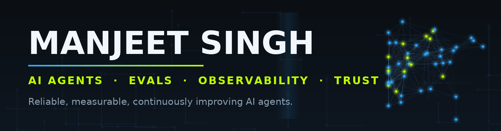
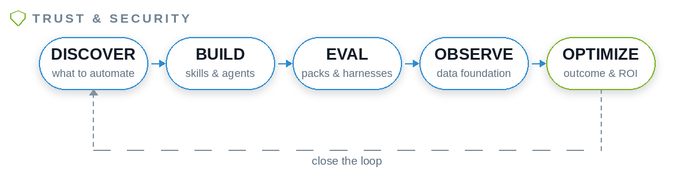

AI Product Lead — Agent Platforms, Evals, Observability & Trust  
📍 San Francisco Bay Area

I build production-ready AI agent systems and publish working reference implementations across evaluation, observability, and self-improving agent loops.

My focus is simple:

> How do we make AI agents reliable, measurable, and continuously improving in production?

---

## What I work on

A connected stack for the **Agent Development Life Cycle** — discover what to automate, build the agent, ship with evals, observe in production, and close the loop with auto-optimization. Each project below plugs into that flywheel.

 

## 🎓 Teaching

**AI Evals in Practice: For Engineers & PMs** — my six-week live course on ByteByteGo.

One agent (Pronto, a grocery support bot), traced end-to-end across six weeks: error analysis, LLM judges, adversarial testing, RAG evals, multi-agent evals, and production eval infrastructure. Production tooling throughout — LangSmith, Braintrust, CrewAI. Week 1 needs no API key at all.

[Explore the course repo →](https://github.com/coachmanjeet/AI-Agent-Evals-Course)

**[👉 Register for the course](https://live.bytebytego.com/courses/ai-evals)**

## Ready-to-run examples: clone → install → run

| # | Name | Repo | What it helps you achieve |
|:-:|---|---|---|
| 1 | 🧠 **AI PM Team OS** | [`ai-pm-team-os`](https://github.com/coachmanjeet/ai-pm-team-os) | A Claude Code-powered operating system for AI product teams — skills do the work, agents review it. |
| 2 | 🧭 **AI Product Strategy** | [`ai-product-strategy`](https://github.com/coachmanjeet/ai-product-strategy) | Putting Agentforce in front of service queues — resolve issues automatically without breaking trust or governance. |
| 3 | 🧪 **AI Skills Lab** | [`AI-Skills-Lab`](https://github.com/coachmanjeet/AI-Skills-Lab) | Hands-on eval curriculum — PM-friendly, browser-based, no accounts. |
| 4 | 📡 **Agent Ops** | [`agent-ops`](https://github.com/coachmanjeet/agent-ops) | Operating, observing, and continuously improving AI agents in production. |
| 5 | 🔬 **DeepDive into Claude Code** | [`DeepDive-into-Claude-Code`](https://github.com/coachmanjeet/DeepDive-into-Claude-Code) | Learn Claude Code's architecture and design patterns to build more capable AI coding agents. |
| 6 | 🤖 **Agentforce ADLC** | [`agentforce-adlc`](https://github.com/coachmanjeet/agentforce-adlc) | Build, deploy, test, and optimize Agentforce agents — the Agent Development Life Cycle. |

 

## 🏢 Ventures

| Venture | What it is |
|---|---|
| [Agent Gym](https://github.com/AgileAiLab/agent-gym) | Independent 360° fitness testing for AI agents — Physical, Mental, Financial, Spiritual, Trust |
| [Specialized Evals Packs](https://github.com/AgileAiLab/specialized-evals-packs) | Productized eval packs: realistic scenarios, fixtures, and graders for specific agent workflows |
| [AgileFitness](https://github.com/coachmanjeet/agilefitness) | Fitness and wellness for the modern human — book + coaching |

 

---
## 🧪 Research & In-Flight

- ✅ **Multi-modal & Multi-agent Evals** — Testing agents that see, hear, and collaborate: cross-modal consistency (does the reply match the photo?), ingestion fidelity (did the agent actually read the image right?), and evals for multi-agent orchestration. Started: multimodal evals are now in the [course](https://github.com/coachmanjeet/AI-Agent-Evals-Course/tree/main/resources/multimodal-evals).
- 🔁 **Always-on, Long-running Agents** — Agents that run for hours and days, not seconds. How do you eval drift, memory decay, and compounding errors over long horizons? The reliability question behind the entire always-on thesis.
- 🧠 **RSI: Recursive Self-Improvement** — Agents that rewrite their own prompts, evals, and workflows. The hard problem: eval the *improver*, not just the output — who grades the grader when the grader rewrites itself?
- 🤖 **Physical AI Evals** — Evaluating robots and embodied agents: perception-action loops, safety in the physical world, and the sim-to-real gap. Where evals meet reality.

 
---

⚡ Building the infrastructure for trustworthy, observable, continuously-improving AI agents. DMs open for advisory conversations on enterprise AI strategy.
